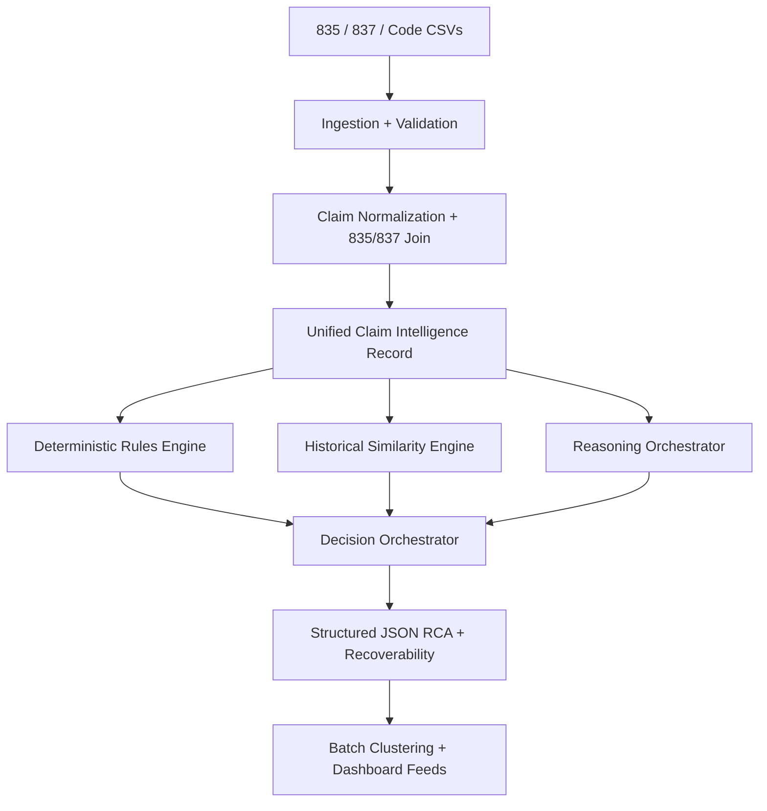

# ClaimSense AI

ClaimSense AI is a production-oriented FastAPI service for denial root cause analysis, recoverability scoring, and batch prioritization across joined 835 remittance and 837 claim submission data.

## 1. Problem Understanding

Denial codes alone do not tell billing teams what to do next. Real recovery decisions depend on claim facts, payer policy, historical outcomes, documentation gaps, and whether a denial is still operationally recoverable.

This project treats the problem the way a denial analyst would:

- Join 835 and 837 records into a single evidence-backed claim view.
- Run deterministic rules before any narrative generation.
- Compare the denied claim to similar historical claims.
- Produce structured JSON with root cause, recoverability verdict, confidence, and cited evidence.
- Roll individual analyses into work-queue style batch clusters tied to dollars at risk.

## 2. Solution Overview

ClaimSense uses a hybrid architecture:

- Rules engine for deterministic checks such as timely filing, missing information, medical necessity hints, and duplicate detection.
- Similarity engine for structured historical matching using payer, CPT, diagnosis overlap, modifiers, provider, amount, and date proximity.
- Reasoning orchestrator for evidence-first explanation generation that can later be backed by a real LLM provider without changing the API contract.
- Batch clustering layer for high-value denial work queues.

The service is packaged as a FastAPI app with versioned routes, health checks, typed request and response schemas, app factory setup, and Uvicorn deployment settings.

## 3. Architecture Diagram



## 4. Key Design Decisions

### Why hybrid instead of LLM-only?

LLMs should explain, not invent. Timely filing, duplicate checks, and missing authorization detection are deterministic and must be validated directly from claim fields. Historical recovery patterns also need explicit similarity logic so exact payer and procedure matches outweigh generic semantic resemblance.

### Why evidence-first outputs?

Each conclusion should point back to actual claim fields. This keeps analyst trust high, supports auditing, and creates measurable evaluation metrics such as evidence precision and hallucinated field rate.

### Why structured similarity first?

Payer, CPT, diagnosis overlap, and modifiers are clinically and financially important fields that should dominate nearest-neighbor retrieval. A semantic narrative layer can help, but only after exact healthcare facts are scored.

## 5. Repo Layout

```text
ClaimSense/
├── data/
├── knowledge/
├── notebooks/
├── prompts/
├── scripts/
├── src/claimsense/
├── tests/
├── .env.example
├── pyproject.toml
└── README.md
```

## 6. Sample Input -> Output

### Input

```json
{
  "claim_837": {
    "claim_id": "CLM-2026-00391",
    "payer": "Aetna",
    "insurance_type": "commercial",
    "claim_amount": 1400,
    "service_date_from": "2026-02-10",
    "service_date_to": "2026-02-10",
    "received_date": "2026-02-20",
    "diagnosis_codes": ["M54.5", "M51.16"],
    "procedure_lines": [
      {
        "line_id": "1",
        "procedure_code": "72148",
        "modifiers": [],
        "charge_amount": 1400
      }
    ],
    "provider_npi": "1234567890",
    "prior_auth": "",
    "claim_frequency": "1"
  },
  "claim_835": {
    "claim_id": "CLM-2026-00391",
    "paid_amount": 0,
    "denied_amount": 1400,
    "adjustment_codes": ["50"],
    "remark_codes": ["N386"]
  }
}
```

### Output

```json
{
  "claim_id": "CLM-2026-00391",
  "denial_category": "medical_necessity",
  "recoverability_verdict": "needs_review",
  "confidence": 0.73,
  "recommended_action": "Review payer policy, confirm whether prior authorization was required, and appeal with supporting clinical documentation if available."
}
```

The output is driven by:

- CARC 50 and RARC N386 medical necessity context
- Missing prior authorization
- Diagnosis and CPT combination
- Historical similarity from comparable claims

## 7. API Surface

- `GET /health/live` for liveness
- `GET /health/ready` for readiness
- `POST /api/v1/claims/analyze` for single-claim denial analysis
- `POST /api/v1/claims/batch/analyze` for batch analysis and clustering
- `POST /api/v1/claims/clusters` for clustering pre-analyzed denial outputs

Interactive docs are available at `/docs`.

## 8. How To Run

### Install

```bash
uv venv
source .venv/bin/activate
uv pip install -e ".[dev]"
```

### Start the API locally

```bash
uvicorn claimsense.api.main:create_app --factory --host 0.0.0.0 --port 8000 --reload
```

### Start with production-style settings

```bash
uvicorn claimsense.api.main:create_app --factory --host 0.0.0.0 --port 8000 --workers 2 --proxy-headers
```

### Run tests

```bash
pytest
```

### Run CLI examples

```bash
python scripts/run_single_claim.py
python scripts/run_batch.py
```

## 9. Evaluation Metrics

This repo includes scaffolding for:

- Root cause accuracy
- Recoverability accuracy
- Evidence precision
- JSON validity rate
- Unsupported claim rate
- Similarity precision@k and recall@k
- Cluster revenue capture

## 10. What I Would Improve With More Time

- Replace the deterministic reasoning fallback with a real LLM adapter and response validation retry loop.
- Add a persistent vector store and feature store for large historical corpora.
- Expand payer-rule coverage with real contractual and CMS sources.
- Add async background jobs, tracing, auth, and durable storage for production deployment.
- Ship a frontend work queue and analyst review console on top of the batch endpoints.
